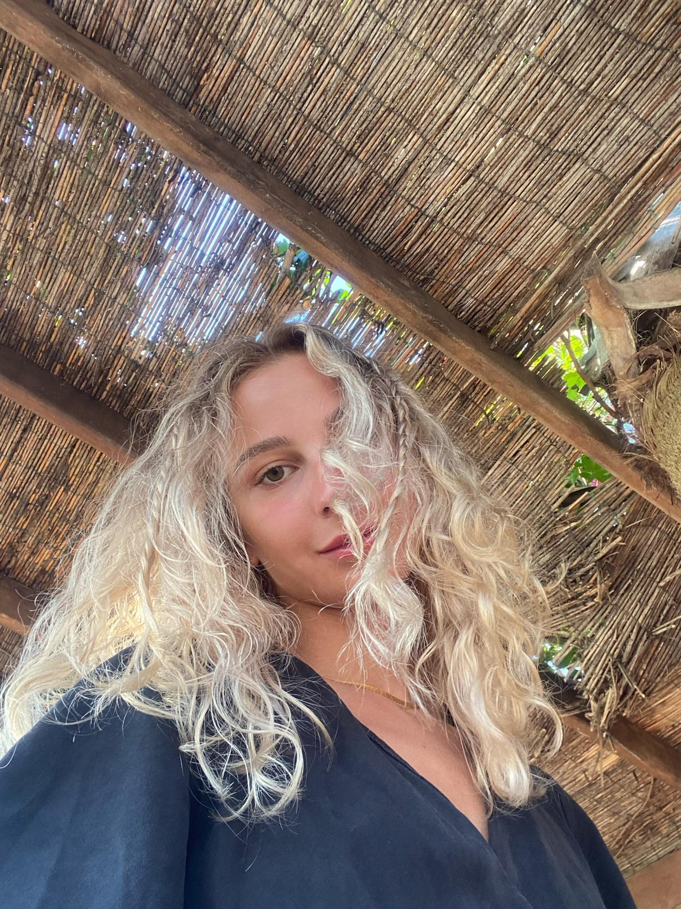

# Ana Solomonia

# Contact Info

Address: Al.Kazbegi Street 34a, Tbilisi, Georgia

Mobile number: +995 555 55 56 54

Email: ana.solomonia@gmail.com

Sex F | Date of birth 24/05/1998 | Nationality Georgia

## Work Experience
* 2019.05-2019.08
  * Intern Georgian National Energy and Water Supply Regulatory Commission 
* 2020.10-2021.02 
  * Front-End Web Developer(Intern) Ministry of Labour, Health and Social Affairs of Georgia 
* 2018-2019
   * Project Assistant / Translator USDA / NASS 
* 2021.02-Present 
  * Data Analyst Ministry of Labour, Health and Social Affairs of Georgia

# Education and Knowledge

* 2016 - 2020
  * BA at CSB, Caucasus School of Business 
    * Good knowledge and high grades in:  Business communication, Management, Data analysis, Calculus, Academic writing, Marketing.
* 2013 - 2016
  * Buckswood International School-Tbilisi 
    * The school aims for high knowledge of technical subjects and English. 
*  2015 - 2016
      * Buckswood International School-Hastings 
	    * 3-month exchange program in England, Hastings

# Personal Skills
Mother Language: Georgian

Other language(s): 
* English (Advanced) 
* Russian (Upper Intermediate) 
* French(Beginner) 
# Digital skills 

* SQL, C#, React, Javascript, HTML, CSS. (Still in learning process)
* MS Office: Word, PowerPoint, Excel, Access, MS Project. 
* SPSS, Adobe Photoshop.

# ADDITIONAL INFORMATION 
### Course Certifications 
*  Completed Training course: “Advanced Excel 2016”
*  Summer School of Greece (2014)
* Summer School of Greece (2015) 
*  Summer School of London (2015) 
* Leadership and Teamwork (2016)
*  Pre-Baccalaureate Program (2016)

# My React Projects 🥰

[Quiz App](https://github.com/Anasolo/QuizApp)

[Movie App](https://github.com/Anasolo/MovieApp) (Not Completed Yet)

# Summary

I am a very motivated self-taught programmer (Yes, I already call myself a programmer, so I'm bringing it to the reality)😇. Even though it has been very hard for me to start learning totally new thing by myself, I did not give up and this is the reason why I am so sure, that I'll do anything to achieve my goals🥇. My future plans are so bright and charming, that I can't wait to be a successful Web Developer 🥰. I've always imagined my job to be interesting, not boring and monotonous. What I like in being a programmer is that, I know, one day I'll be able to work and travel at the same time, so my life will be filled with happy moments, joy and also with a job I like to do.